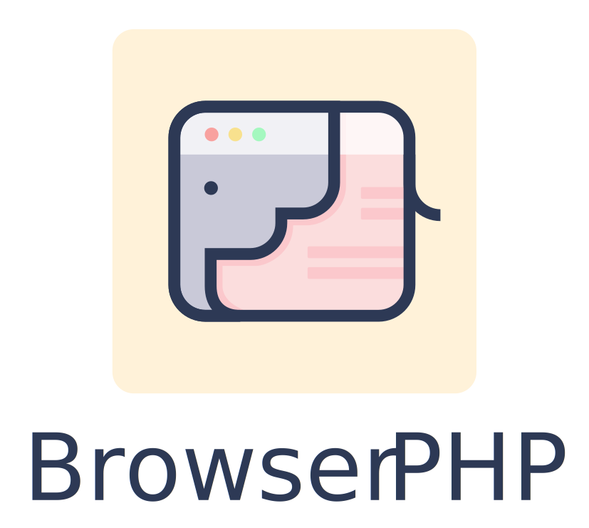

<p align="center"></p>

Run any PHP stuff within your browser.

The Browser PHP package offers a collection of commands for running PHP from the Node CLI or for launching a PHP server from Node. Perfect for running a Laravel project in CodeSandbox, for example.

<br>

 [This article](https://capsules.codes/en/blog/fyi/en-fyi-run-laravel-on-your-browser-with-browser-php) provides an in-depth exploration of the package.

<br>

## Installation

```bash
npm install --save-dev @capsulescodes/browser-php
```

<br>
<br>

## Usage

This package gives access to three binaries. `php-cli` and `php-server` from `node_modules`, `composer` from `vendor`.

<br>

### PHP
```
node node_modules/.bin/php-cli
```

<br>

Or add `script` in `package.json`
```
"scripts" : {
    "php" : "php-cli"
},
```

<br>

Example
```
npm run php -r "echo 'Hello Browser PHP World!';"


> Hello Browser PHP World!
```

<br>
<br>

### Serve
```
node node_modules/.bin/php-server
```

<br>

Or add `script` in `package.json`
```
"scripts" : {
    "serve" : "php-server"
},
```

<br>

Example
```
npm run serve


> PHP server is listening on url http://localhost:2222
```

<br>
<br>


### Composer
```
node node_modules/.bin/php vendor/bin/composer
```

<br>

Or add `script` in `package.json`
```
"scripts" : {
    "composer": "php-cli vendor/bin/composer"
},
```

<br>

Example
```
npm run composer

>    ______
>   / ____/___  ____ ___  ____  ____  ________  _____
>  / /   / __ \/ __ `__ \/ __ \/ __ \/ ___/ _ \/ ___/
> / /___/ /_/ / / / / / / /_/ / /_/ (__  )  __/ /
> \____/\____/_/ /_/ /_/ .___/\____/____/\___/_/
>                     /_/
> Composer version 2.7.7 2024-06-10 22:11:12
```

<br>
<br>

## Configuration

The scripts can be configured with environment variables

- `BROWSER_PHP_VERSION` : The PHP version you need | default : `8.2`

- `BROWSER_PHP_COMPOSER_VERSION` : The Composer executable version | default : `2.7.7`
- `BROWSER_PHP_COMPOSER_PATH` : The Composer executable path | default : `vendor/bin`
- `BROWSER_PHP_COMPOSER_NAME` : The Composer executable name | default : `composer`

- `BROWSER_PHP_SERVER_HOST` : The host name you need | default : `http://localhost`
- `BROWSER_PHP_SERVER_PORT` : The port you need | default : `2222`
- `BROWSER_PHP_SERVER_PATH` : The directory path you need | default : `public`
- `BROWSER_PHP_SERVER_DEBUG` : The debug mode you need | default : `false`

<br>
<br>

## Contributing

Pull requests are welcome. For major changes, please open an issue first to discuss what you would like to change.
Please make sure to update tests as appropriate.

## Credits

- [Capsules Codes](https://github.com/capsulescodes)

## License

[MIT](https://choosealicense.com/licenses/mit/)
